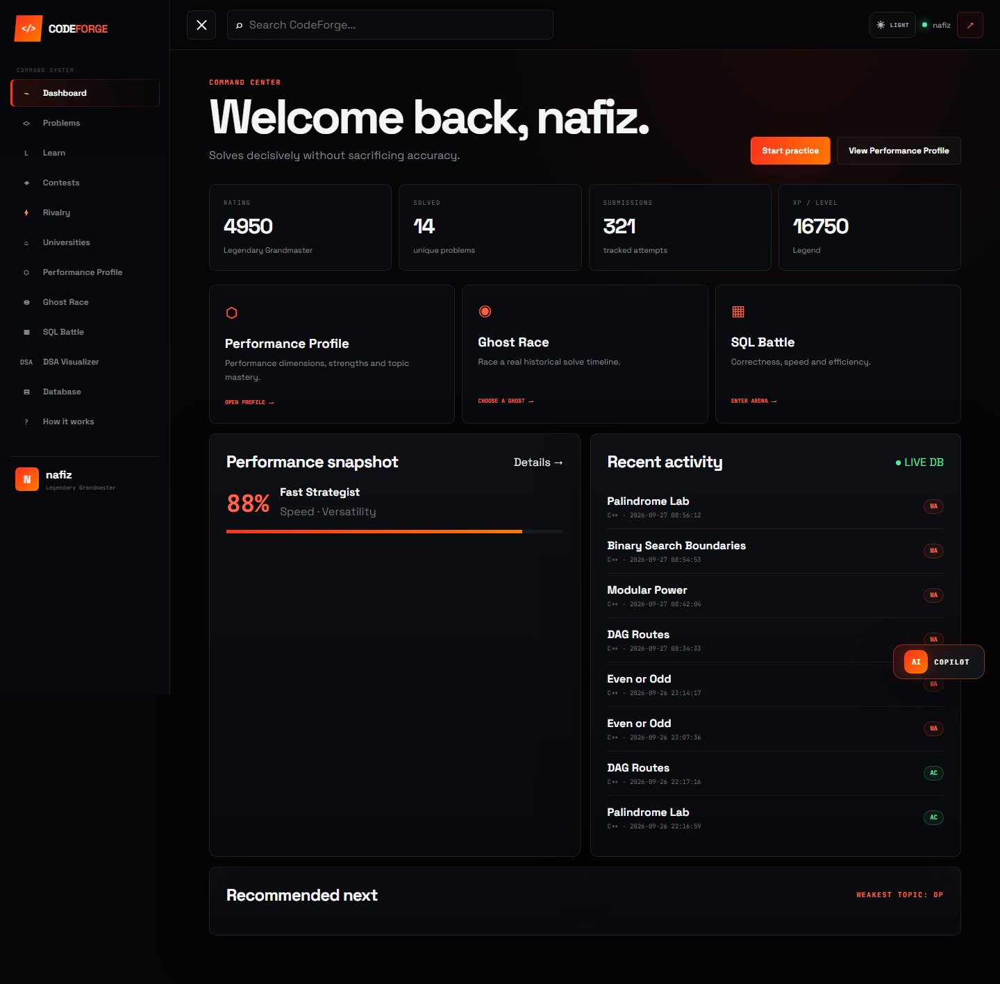
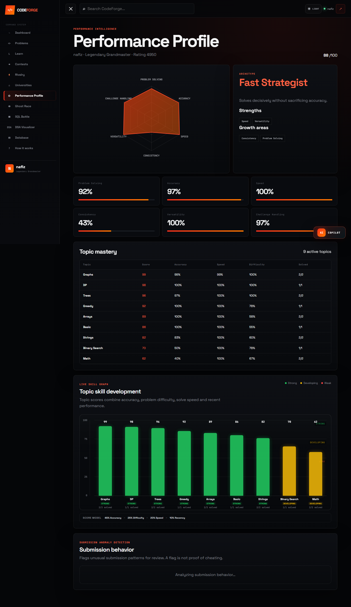
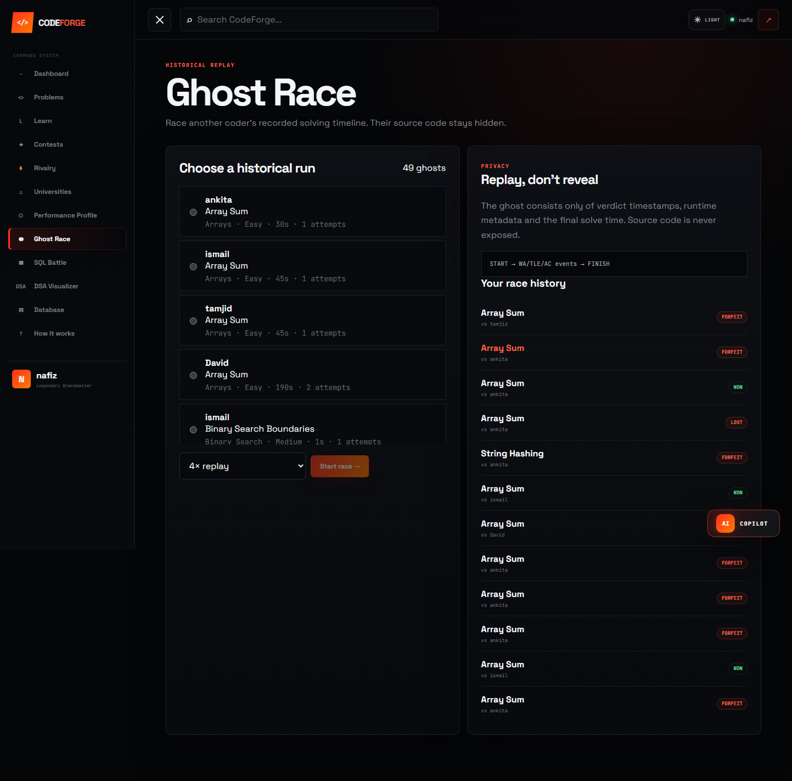
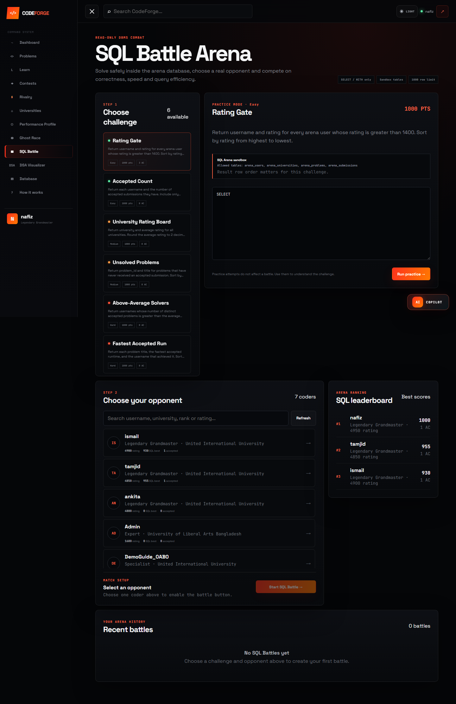
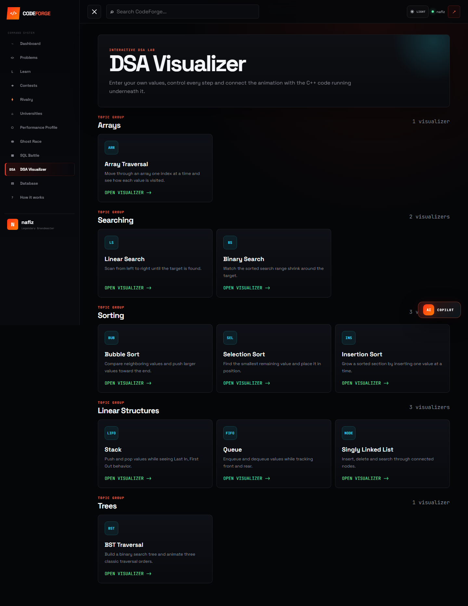
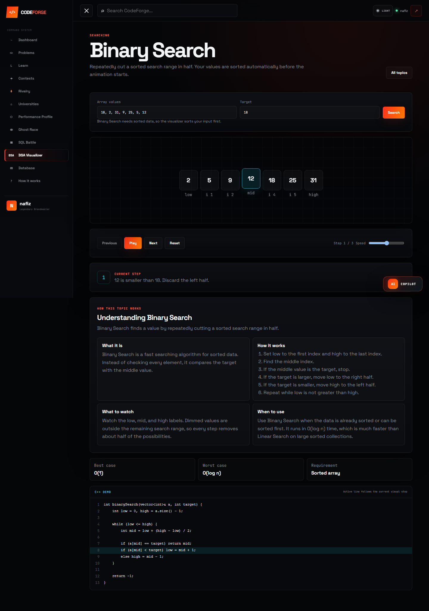
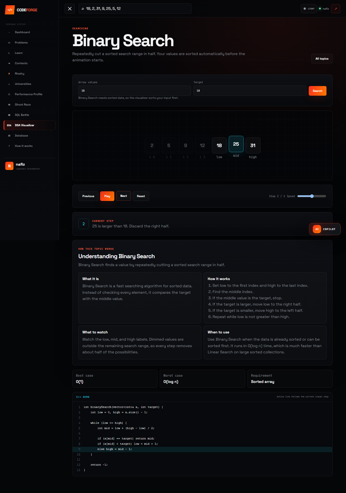
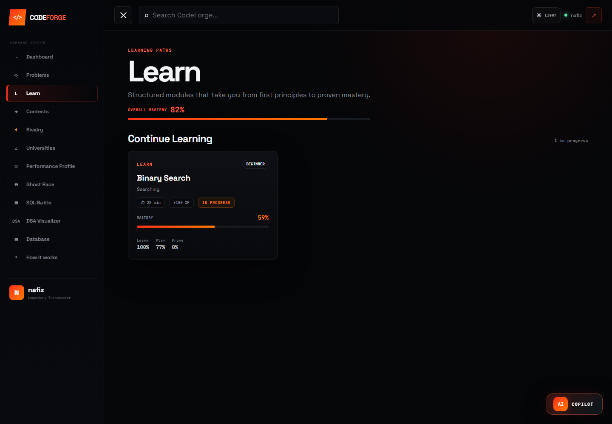

# CodeForge - Feature Demo Guide

This guide demonstrates the main CodeForge workflows with screenshots captured from the running application.

## 1. Dashboard

The dashboard is the authenticated starting point for the competitive-programming, analytics, learning, and AI-assisted features.

---

## 2. Performance Profile

### Workflow

1. The user opens Performance Profile.
2. CodeForge reads submission and problem-session history.
3. Backend queries aggregate activity by topic.
4. PerformanceProfileCalculator converts the raw activity into skill scores.
5. The Svelte frontend presents the profile visually.

### Technical flow

`	ext
User
  -> Performance Profile page
  -> Laravel API
  -> PerformanceProfileController
  -> PerformanceProfileService
  -> submissions + problem_sessions
  -> PerformanceProfileCalculator
  -> JSON
  -> Svelte UI
`

### Main topic formula

`	ext
Topic Score =
45% Accuracy
+ 25% Difficulty
+ 20% Speed
+ 10% Recency
`

The profile includes Problem Solving, Accuracy, Speed, Consistency, Versatility, and Challenge Handling.

---

## 3. Ghost Race

### Workflow

1. The user chooses a ghost opponent.
2. A ghost represents a historical solved problem session.
3. CodeForge replays the ghost submission timeline using recorded elapsed times.
4. The challenger solves the same problem.
5. An accepted challenger solution is compared with the ghost solve time.
6. The result becomes Won, Draw, Lost, or Forfeit.

### Technical flow

`	ext
Historical solved session
  -> Ghost candidate
  -> Create ghost_race + challenger problem_session
  -> Replay historical submissions
  -> Challenger submits
  -> Judge
  -> Compare solve times
  -> Won / Draw / Lost
`

Ghost Race is asynchronous. Both users do not need to be online at the same time.

> Screenshot not captured automatically. Add it later at docs/images/ghost-race/02-race-screen.png.

---

## 4. SQL Battle

### Workflow

1. A SQL challenge is selected.
2. Two users compete on the same task.
3. Each user submits a SQL query.
4. The SQL judge validates the query before execution.
5. Reference and submitted result sets are normalized and compared.
6. Correct queries receive speed and efficiency scoring.
7. The best accepted scores determine the winner.

### Safety model

The SQL judge is designed around read-only arena access. It restricts submitted SQL to approved query forms and arena tables and rejects dangerous mutation/schema operations.

Additional protections include table whitelisting, one-statement validation, query/result limits, and statement execution limits.

### Judging flow

`	ext
Submitted SQL
  -> Safety validation
  -> Execute reference query
  -> Execute user query
  -> Normalize results
  -> Compare correctness
  -> EXPLAIN for efficiency
  -> Runtime scoring
  -> Final battle score
`

> Screenshot not captured automatically. Add it later at docs/images/sql-battle/02-battle-screen.png.

---

## 5. DSA Visualizer

The DSA Visualizer is a frontend learning feature. It currently includes Array Traversal, Linear Search, Binary Search, Bubble Sort, Selection Sort, Insertion Sort, Stack, Queue, Singly Linked List, and BST Traversal.

### Binary Search

Each algorithm first creates a sequence of step-state objects. The current step controls the visualization, explanation, and highlighted C++ line.

`js
{
  values: [...],
  low: 0,
  mid: 2,
  high: 5,
  message: "...",
  codeLine: 8
}
`

This model makes Play, Pause, Previous, Next, Reset, and speed control straightforward because navigation only changes the current step index.

---

## 6. AI Copilot

> Screenshot not captured automatically. Add it later at docs/images/ai-copilot/01-open.png.

AI Copilot is CodeForge-aware rather than being only a generic chatbot.

### Workflow

`	ext
User message
  -> local intent handling
  -> CodeForge user/platform context
  -> Groq API
  -> structured response
  -> allowed CodeForge action
  -> frontend response
`

It can support performance analysis, weak-topic detection, practice recommendations, learning plans, platform navigation, and coding-improvement guidance.

The Groq key remains on the Laravel backend and is not exposed to the Svelte frontend.

> Screenshot not captured automatically. Add it later at docs/images/ai-copilot/02-recommendation.png.

---

## 7. AI Judge Feedback

AI Judge is connected to the normal programming-submission workflow.

`	ext
Submission
  -> Judge verdict
  -> Accepted?
       Yes -> normal success flow
       No  -> AI Judge
  -> Groq analysis
  -> diagnosis + progressive hints
`

The feedback can include diagnosis, concept hints, algorithm hints, likely implementation bugs, and topics to review.

> The builder deliberately does not force an incorrect programming submission because that would depend on the current problem, editor, selected language, and demo data. Capture that one workflow manually if you want it shown.

---

## 8. Learn / Play / Prove

The learning flow is structured as:

`	ext
LEARN
  -> PLAY
  -> PROVE
`

The initial module focuses on Binary Search.

> Screenshot not captured automatically. Add it later at docs/images/learn/02-binary-search-module.png.

The Play stage includes Half Hunt, Midpoint Master, and Trace Race.

> Screenshot not captured automatically. Add it later at docs/images/learn/03-play-stage.png.

---

## 9. Complete Product Flow

`	ext
Authentication
  -> Dashboard
  -> Problems / Contests / Learning

Problem solving
  -> Submission
  -> Verdict
  -> Performance history
  -> Performance Profile

Historical solved sessions
  -> Ghost Race

SQL challenges
  -> SQL Battle

Learning
  -> DSA Visualizer
  -> Learn / Play / Prove

Platform context
  -> AI Copilot

Failed programming submission
  -> AI Judge feedback
`

---

## 10. Technology Stack

### Backend
- Laravel
- PHP
- MariaDB / MySQL
- Laravel Sanctum
- Groq API

### Frontend
- SvelteKit
- JavaScript / TypeScript
- Vite

### Local development
- XAMPP
- Node.js / npm

---

## Regenerating the demo

Rerun the demo-builder script while CodeForge is running locally. Use -Interactive to let the script try deeper UI interactions such as starting a Ghost Race, opening a SQL Battle, stepping through Binary Search, sending an AI Copilot prompt, and opening the Learn module.

