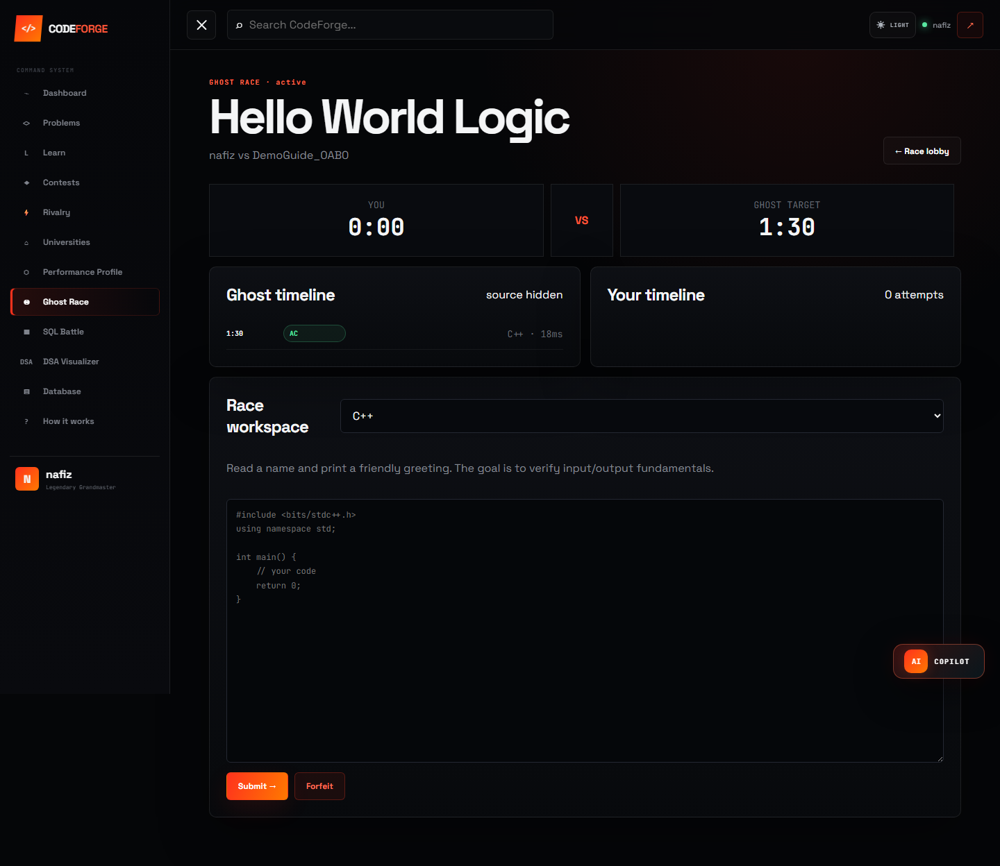
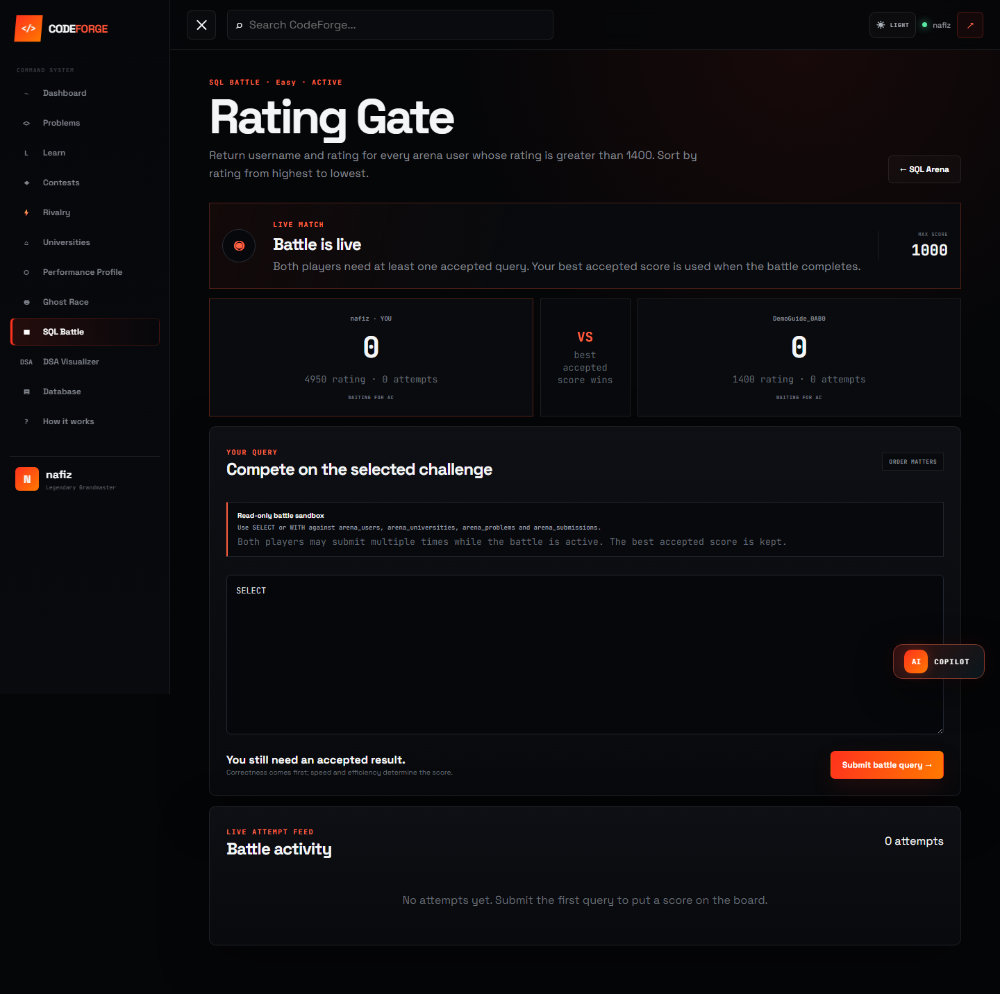
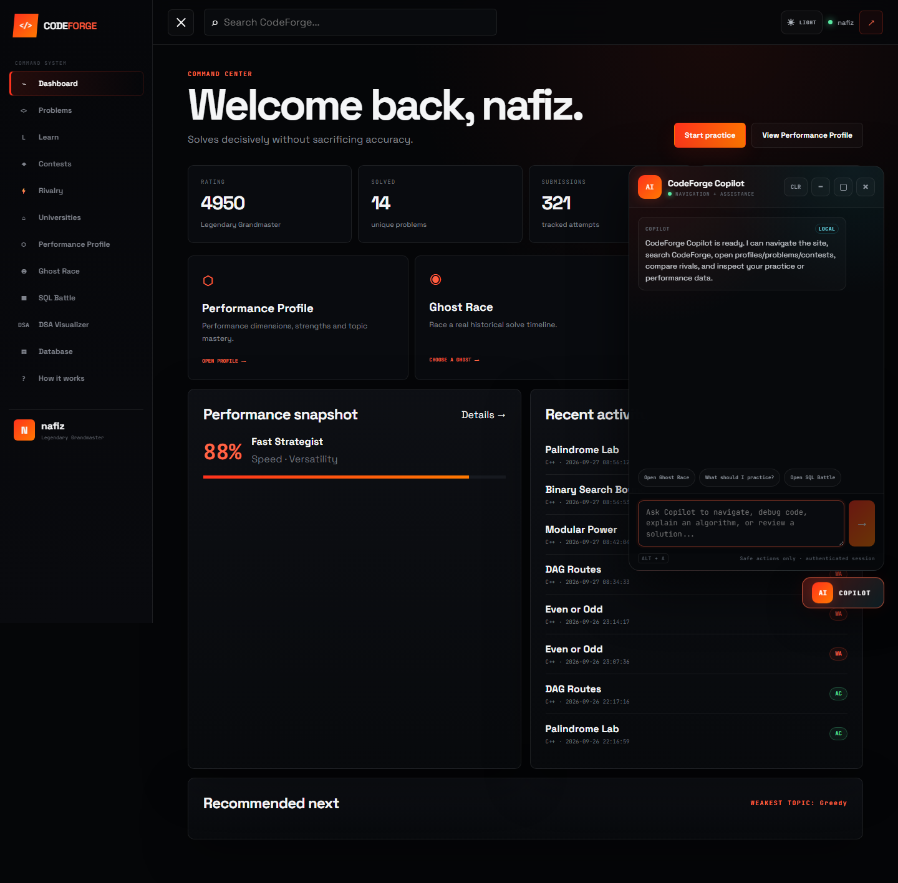
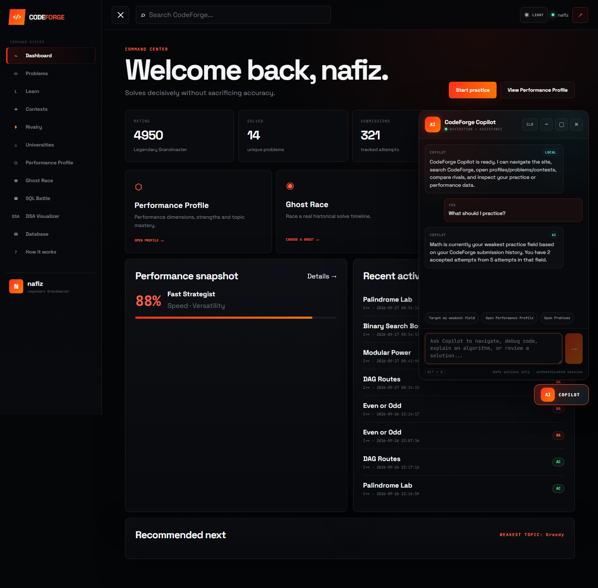
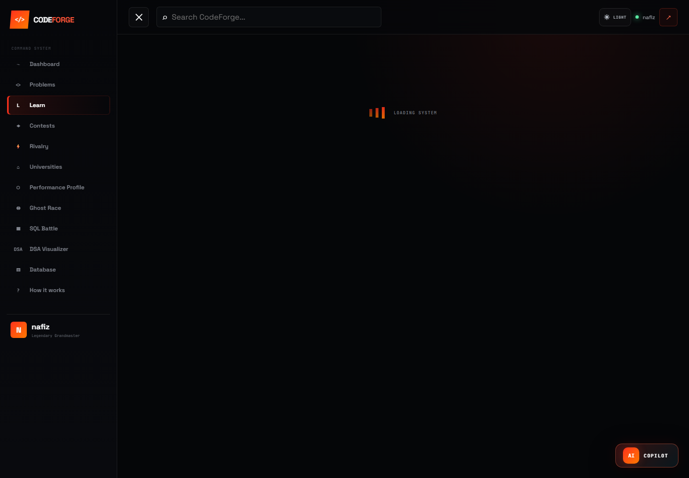

# CodeForge Feature Walkthrough

This page shows the main features of CodeForge and how each part works.

## 1. Dashboard


The dashboard is the main entry point after login. From here, users can move between problem solving, contests, performance tracking, learning tools, and the other CodeForge features.

---

## 2. Performance Profile


### How it works

1. The user's submissions and problem sessions are loaded.
2. Activity is grouped by topic and difficulty.
3. The backend calculates the performance scores.
4. The results are shown in the Performance Profile page.

### Backend flow

```text
Performance Profile page
        |
        v
Laravel API
        |
        v
PerformanceProfileController
        |
        v
PerformanceProfileService
        |
        v
PerformanceProfileCalculator
        |
        v
Profile data
        |
        v
Svelte UI
```

The topic score uses four parts:

```text
45% Accuracy
25% Difficulty
20% Speed
10% Recency
```

The profile also tracks Problem Solving, Accuracy, Speed, Consistency, Versatility, and Challenge Handling.

---

## 3. Ghost Race


Ghost Race lets a user compete against another user's previous solved session.

### How it works

1. A historical solved session is selected as the ghost.
2. A new problem session is created for the challenger.
3. The ghost's old submission timeline is replayed.
4. The challenger solves the same problem.
5. The final accepted solve times are compared.

```text
Historical solved session
        |
        v
Ghost opponent
        |
        v
Create race
        |
        v
Replay ghost timeline
        |
        v
Challenger submits
        |
        v
Compare solve times
        |
        v
Won / Draw / Lost
```

The race is asynchronous, so both users do not have to be online at the same time.

### Active race



---

## 4. SQL Battle


SQL Battle gives two users the same SQL challenge and compares their accepted solutions.

### How it works

1. The user selects a challenge and an opponent.
2. Both users submit SQL queries for the same task.
3. The query is checked before it is executed.
4. The submitted result is compared with the expected result.
5. Correct queries receive speed and efficiency scores.
6. The best accepted score wins the battle.

### Query checks

SQL Battle only allows the query types needed for the arena. It blocks operations that could change tables or database structure.

The checks include:

- approved arena tables only;
- a single SQL statement;
- read-only query rules;
- query and result limits;
- execution-time limits.

### Judge flow

```text
Submitted query
        |
        v
Validation
        |
        v
Run reference query
        |
        v
Run user query
        |
        v
Compare results
        |
        v
Check efficiency and runtime
        |
        v
Final score
```

### Active battle



---

## 5. DSA Visualizer


The DSA Visualizer shows common algorithms and data structures one step at a time.

Current topics include:

- Array Traversal
- Linear Search
- Binary Search
- Bubble Sort
- Selection Sort
- Insertion Sort
- Stack
- Queue
- Singly Linked List
- BST Traversal

### Binary Search


Each algorithm creates a list of execution steps. A step stores the values needed to draw the current state and highlight the matching C++ line.

```js
{
  values: [...],
  low: 0,
  mid: 2,
  high: 5,
  message: "...",
  codeLine: 8
}
```

The current step is used by the Play, Pause, Previous, Next, Reset, and speed controls.


---

## 6. AI Copilot



The Copilot is connected to CodeForge data and actions, so it can answer questions about the user's activity as well as help with navigation.

### Request flow

```text
User message
        |
        v
Intent check
        |
        v
CodeForge user context
        |
        v
Groq API
        |
        v
Structured response
        |
        v
CodeForge action or reply
```

It can help with:

- weak-topic analysis;
- practice suggestions;
- performance questions;
- learning plans;
- CodeForge navigation;
- coding guidance.

The Groq API key stays on the Laravel backend.

### Practice suggestion



---

## 7. AI Judge Feedback

AI Judge is used after an unsuccessful programming submission.

```text
Submission
        |
        v
Judge verdict
        |
        +---- Accepted -> normal success flow
        |
        +---- Failed
                 |
                 v
              AI Judge
                 |
                 v
        Diagnosis and hints
```

The feedback can point out the likely issue, give concept or algorithm hints, and suggest what the user should review before trying again.

---

## 8. Learn / Play / Prove


The learning section follows three stages:

```text
LEARN -> PLAY -> PROVE
```

The first module is based on Binary Search.

### Learn



The Learn stage introduces the topic before the user moves to practice.

### Play

The Play stage contains three Binary Search mini games:

- Half Hunt
- Midpoint Master
- Trace Race

### Prove

The final stage connects the lesson to a normal CodeForge problem so the user can apply the same idea in a coding task.

---

## 9. Main Project Flow

```text
Login
  |
  v
Dashboard
  |
  +--> Problems and Submissions
  |       |
  |       +--> Performance Profile
  |       +--> AI Judge
  |
  +--> Ghost Race
  |
  +--> SQL Battle
  |
  +--> DSA Visualizer
  |
  +--> Learn / Play / Prove
  |
  +--> AI Copilot
```

---

## 10. Technology Stack

### Backend

- Laravel
- PHP
- MariaDB / MySQL
- Laravel Sanctum
- Groq API

### Frontend

- SvelteKit
- JavaScript / TypeScript
- Vite

### Development

- XAMPP
- Node.js
- npm
